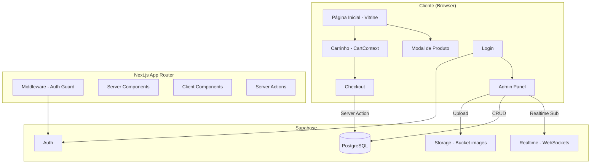

# LancheFlow — Sistema de Delivery Completo

Sistema de delivery para lanchonete com Next.js App Router, Tailwind CSS, Supabase (Auth, Storage, Realtime) e TypeScript.

## User Review Required

> [!IMPORTANT]
> **Configuração do Supabase**: Antes de iniciar o desenvolvimento, você precisará criar um projeto no [Supabase Dashboard](https://supabase.com/dashboard) e fornecer as variáveis de ambiente (`SUPABASE_URL` e `SUPABASE_ANON_KEY`). Também será necessário executar o SQL de criação das tabelas e configurar o bucket de Storage manualmente no dashboard.

> [!WARNING]
> **Tailwind CSS**: Você solicitou TailwindCSS. Usaremos a **versão 4** (a mais recente, incluída por padrão no `create-next-app`). Confirme se deseja a v4 ou prefere a v3.

> [!IMPORTANT]
> **Usuário Admin Inicial**: O primeiro admin deverá ser criado manualmente via Supabase Dashboard (Authentication > Users > Add User). Não haverá tela de registro público de admin.

---

## Arquitetura Geral



---

## Estrutura de Diretórios

```
c:\TRABALHOS\SISTEMA_SAS_LANCHES\
├── src/
│   ├── app/
│   │   ├── layout.tsx                 # Root layout (ThemeProvider, CartProvider)
│   │   ├── page.tsx                   # Home - Vitrine do cliente
│   │   ├── checkout/
│   │   │   └── page.tsx               # Checkout page
│   │   ├── login/
│   │   │   └── page.tsx               # Login admin
│   │   └── admin/
│   │       ├── layout.tsx             # Admin layout com tabs
│   │       └── page.tsx               # Admin panel (pedidos + cardápio)
│   ├── components/
│   │   ├── ui/                        # Componentes base reutilizáveis
│   │   │   ├── Button.tsx
│   │   │   ├── Input.tsx
│   │   │   ├── Modal.tsx
│   │   │   ├── Badge.tsx
│   │   │   └── Tabs.tsx
│   │   ├── Header.tsx                 # Header fixo com nome, carrinho, tema
│   │   ├── ThemeToggle.tsx            # Botão dark/light mode
│   │   ├── StoreStatusBanner.tsx      # Banner aberto/fechado
│   │   ├── CategorySection.tsx        # Seção de categoria com produtos
│   │   ├── ProductCard.tsx            # Card de produto
│   │   ├── ProductModal.tsx           # Modal detalhes do produto
│   │   ├── Cart.tsx                   # Mini-carrinho / sidebar
│   │   ├── CartItem.tsx               # Item no carrinho
│   │   ├── CheckoutForm.tsx           # Formulário de checkout
│   │   ├── admin/
│   │   │   ├── OrderKanban.tsx        # Kanban de pedidos
│   │   │   ├── OrderCard.tsx          # Card individual do pedido
│   │   │   ├── ProductForm.tsx        # Form CRUD de produtos
│   │   │   ├── ProductTable.tsx       # Tabela de produtos
│   │   │   └── BusinessHoursForm.tsx  # Config de horários
│   ├── contexts/
│   │   ├── CartContext.tsx            # Context + Provider do carrinho
│   │   └── ThemeContext.tsx           # Context para dark mode
│   ├── lib/
│   │   ├── supabase/
│   │   │   ├── client.ts             # createBrowserClient
│   │   │   ├── server.ts             # createServerClient
│   │   │   └── middleware.ts          # createServerClient para middleware
│   │   ├── types.ts                   # Tipos TypeScript (Database)
│   │   ├── utils.ts                   # Helpers (formatCurrency, etc.)
│   │   └── actions/
│   │       ├── orders.ts             # Server actions de pedidos
│   │       ├── products.ts           # Server actions de produtos
│   │       ├── categories.ts         # Server actions de categorias
│   │       └── business-hours.ts     # Server actions de horários
│   └── middleware.ts                  # Next.js middleware (auth guard)
├── public/
│   └── logo.svg
├── supabase/
│   └── schema.sql                    # SQL completo para setup do banco
├── tailwind.config.ts
├── next.config.ts
├── .env.local.example
└── package.json
```

---

## Proposed Changes

### 1. Configuração do Projeto e Infraestrutura

#### [NEW] Inicialização do Next.js
- Criar projeto Next.js com `create-next-app` (App Router, TypeScript, Tailwind CSS, ESLint)
- Instalar dependências: `@supabase/supabase-js`, `@supabase/ssr`

#### [NEW] [schema.sql](file:///c:/TRABALHOS/SISTEMA_SAS_LANCHES/supabase/schema.sql)
SQL completo para criação do banco:

```sql
-- Tabela de categorias
CREATE TABLE categories (
  id UUID DEFAULT gen_random_uuid() PRIMARY KEY,
  name TEXT NOT NULL,
  sort_order INT DEFAULT 0,
  created_at TIMESTAMPTZ DEFAULT now()
);

-- Tabela de produtos
CREATE TABLE products (
  id UUID DEFAULT gen_random_uuid() PRIMARY KEY,
  name TEXT NOT NULL,
  description TEXT,
  price NUMERIC(10,2) NOT NULL,
  image_url TEXT,
  category_id UUID REFERENCES categories(id) ON DELETE SET NULL,
  is_highlight BOOLEAN DEFAULT false,
  is_active BOOLEAN DEFAULT true,
  created_at TIMESTAMPTZ DEFAULT now()
);

-- Horários de funcionamento
CREATE TABLE business_hours (
  id UUID DEFAULT gen_random_uuid() PRIMARY KEY,
  day_of_week INT NOT NULL CHECK (day_of_week BETWEEN 0 AND 6),
  open_time TIME NOT NULL DEFAULT '08:00',
  close_time TIME NOT NULL DEFAULT '22:00',
  is_open BOOLEAN DEFAULT true,
  UNIQUE(day_of_week)
);

-- Pedidos
CREATE TABLE orders (
  id UUID DEFAULT gen_random_uuid() PRIMARY KEY,
  customer_name TEXT NOT NULL,
  customer_phone TEXT NOT NULL,
  address TEXT NOT NULL,
  payment_method TEXT NOT NULL CHECK (payment_method IN ('pix', 'cartao', 'dinheiro')),
  change_for NUMERIC(10,2),
  total NUMERIC(10,2) NOT NULL,
  status TEXT NOT NULL DEFAULT 'novo' CHECK (status IN ('novo', 'preparando', 'entrega', 'concluido')),
  created_at TIMESTAMPTZ DEFAULT now()
);

-- Itens do pedido
CREATE TABLE order_items (
  id UUID DEFAULT gen_random_uuid() PRIMARY KEY,
  order_id UUID REFERENCES orders(id) ON DELETE CASCADE,
  product_id UUID REFERENCES products(id) ON DELETE SET NULL,
  product_name TEXT NOT NULL,
  quantity INT NOT NULL DEFAULT 1,
  unit_price NUMERIC(10,2) NOT NULL,
  observation TEXT
);

-- Seed: Inserir os 7 dias da semana
INSERT INTO business_hours (day_of_week, open_time, close_time, is_open)
VALUES
  (0, '08:00', '22:00', false),  -- Domingo
  (1, '08:00', '22:00', true),   -- Segunda
  (2, '08:00', '22:00', true),   -- Terça
  (3, '08:00', '22:00', true),   -- Quarta
  (4, '08:00', '22:00', true),   -- Quinta
  (5, '08:00', '22:00', true),   -- Sexta
  (6, '08:00', '22:00', true);   -- Sábado

-- RLS Policies
ALTER TABLE categories ENABLE ROW LEVEL SECURITY;
ALTER TABLE products ENABLE ROW LEVEL SECURITY;
ALTER TABLE business_hours ENABLE ROW LEVEL SECURITY;
ALTER TABLE orders ENABLE ROW LEVEL SECURITY;
ALTER TABLE order_items ENABLE ROW LEVEL SECURITY;

-- Leitura pública (anon) para vitrine
CREATE POLICY "Public read categories" ON categories FOR SELECT USING (true);
CREATE POLICY "Public read products" ON products FOR SELECT USING (true);
CREATE POLICY "Public read business_hours" ON business_hours FOR SELECT USING (true);

-- Clientes podem criar pedidos (anon)
CREATE POLICY "Anon can insert orders" ON orders FOR INSERT WITH CHECK (true);
CREATE POLICY "Anon can insert order_items" ON order_items FOR INSERT WITH CHECK (true);

-- Admin (authenticated) pode tudo
CREATE POLICY "Admin full access categories" ON categories FOR ALL TO authenticated USING (true) WITH CHECK (true);
CREATE POLICY "Admin full access products" ON products FOR ALL TO authenticated USING (true) WITH CHECK (true);
CREATE POLICY "Admin full access business_hours" ON business_hours FOR ALL TO authenticated USING (true) WITH CHECK (true);
CREATE POLICY "Admin full access orders" ON orders FOR ALL TO authenticated USING (true) WITH CHECK (true);
CREATE POLICY "Admin full access order_items" ON order_items FOR ALL TO authenticated USING (true) WITH CHECK (true);
-- Admin can read order_items
CREATE POLICY "Admin read order_items" ON order_items FOR SELECT TO authenticated USING (true);

-- Habilitar Realtime para pedidos
ALTER PUBLICATION supabase_realtime ADD TABLE orders;
```

#### Supabase Storage Setup (Manual no Dashboard)
1. Criar bucket **`images`** marcado como **público**
2. Adicionar policies:
   - `SELECT` para todos (público)
   - `INSERT` para `authenticated` (admin pode fazer upload)
   - `UPDATE` para `authenticated`
   - `DELETE` para `authenticated`

---

### 2. Supabase Client Setup

#### [NEW] [client.ts](file:///c:/TRABALHOS/SISTEMA_SAS_LANCHES/src/lib/supabase/client.ts)
- `createBrowserClient()` usando `@supabase/ssr` para client components

#### [NEW] [server.ts](file:///c:/TRABALHOS/SISTEMA_SAS_LANCHES/src/lib/supabase/server.ts)
- `createServerClient()` usando cookies do Next.js para server components e server actions

#### [NEW] [middleware.ts (supabase)](file:///c:/TRABALHOS/SISTEMA_SAS_LANCHES/src/lib/supabase/middleware.ts)
- Helper para refresh de sessão no middleware

#### [NEW] [middleware.ts (root)](file:///c:/TRABALHOS/SISTEMA_SAS_LANCHES/src/middleware.ts)
- Protege rota `/admin/*` — redireciona para `/login` se não autenticado
- Chama `updateSession()` para refresh de cookies

---

### 3. Tipos TypeScript

#### [NEW] [types.ts](file:///c:/TRABALHOS/SISTEMA_SAS_LANCHES/src/lib/types.ts)
- Interfaces: `Category`, `Product`, `BusinessHours`, `Order`, `OrderItem`, `CartItem`
- Enums: `OrderStatus`, `PaymentMethod`

---

### 4. Contexts (Estado Global)

#### [NEW] [CartContext.tsx](file:///c:/TRABALHOS/SISTEMA_SAS_LANCHES/src/contexts/CartContext.tsx)
- Provider com `useReducer` para ações: `ADD_ITEM`, `REMOVE_ITEM`, `UPDATE_QUANTITY`, `CLEAR_CART`
- Agrupa itens iguais com mesma observação
- Persistência em `localStorage`
- Calcula total automaticamente

#### [NEW] [ThemeContext.tsx](file:///c:/TRABALHOS/SISTEMA_SAS_LANCHES/src/contexts/ThemeContext.tsx)
- Toggle entre `dark` e `light`
- Aplica classe `dark` no `<html>`
- Persistência em `localStorage`

---

### 5. Módulo do Cliente (Vitrine)

#### [NEW] [layout.tsx](file:///c:/TRABALHOS/SISTEMA_SAS_LANCHES/src/app/layout.tsx)
- Root layout com `ThemeProvider`, `CartProvider`, Google Fonts (Inter)
- Meta tags SEO

#### [NEW] [page.tsx (Home)](file:///c:/TRABALHOS/SISTEMA_SAS_LANCHES/src/app/page.tsx)
- Server Component que busca categorias, produtos e status da loja
- Renderiza `StoreStatusBanner`, `CategorySection` com `ProductCard`
- Passa dados para client components

#### [NEW] [Header.tsx](file:///c:/TRABALHOS/SISTEMA_SAS_LANCHES/src/components/Header.tsx)
- Header fixo (sticky) com glassmorphism
- Nome "LancheFlow" com logo
- Ícone do carrinho com badge de contagem
- ThemeToggle button

#### [NEW] [ProductCard.tsx](file:///c:/TRABALHOS/SISTEMA_SAS_LANCHES/src/components/ProductCard.tsx)
- Card com imagem, nome, preço
- Estrela para `is_highlight`
- Hover com elevação/scale
- onClick abre ProductModal

#### [NEW] [ProductModal.tsx](file:///c:/TRABALHOS/SISTEMA_SAS_LANCHES/src/components/ProductModal.tsx)
- Modal fullscreen em mobile, centered em desktop
- Imagem, título, descrição, preço
- Seletor de quantidade (+/-)
- Campo de observações
- Botão "Adicionar ao Carrinho"

#### [NEW] [Cart.tsx](file:///c:/TRABALHOS/SISTEMA_SAS_LANCHES/src/components/Cart.tsx)
- Sidebar/drawer com lista de itens
- Total calculado
- Botão "Ir para Checkout"

---

### 6. Módulo de Checkout

#### [NEW] [page.tsx (Checkout)](file:///c:/TRABALHOS/SISTEMA_SAS_LANCHES/src/app/checkout/page.tsx)
- Verifica status da loja (se fechada, bloqueia totalmente)
- Lista resumo do pedido
- Formulário: Nome, WhatsApp, Endereço
- Radio buttons: Pix, Cartão, Dinheiro
- Campo condicional "Troco para quanto?" com validação
- Salva dados do cliente em localStorage
- Server Action para inserir pedido + itens
- Limpa carrinho e redireciona com toast de sucesso

---

### 7. Módulo Autenticação

#### [NEW] [page.tsx (Login)](file:///c:/TRABALHOS/SISTEMA_SAS_LANCHES/src/app/login/page.tsx)
- Formulário e-mail + senha
- `supabase.auth.signInWithPassword()`
- Redireciona para `/admin` em caso de sucesso
- Feedback visual de erro

---

### 8. Módulo Admin

#### [NEW] [layout.tsx (Admin)](file:///c:/TRABALHOS/SISTEMA_SAS_LANCHES/src/app/admin/layout.tsx)
- Layout com header admin, botão logout
- Tabs: "Pedidos" | "Cardápio & Horários"

#### [NEW] [page.tsx (Admin)](file:///c:/TRABALHOS/SISTEMA_SAS_LANCHES/src/app/admin/page.tsx)
- Server component que busca pedidos e produtos iniciais
- Passa para client components

#### [NEW] [OrderKanban.tsx](file:///c:/TRABALHOS/SISTEMA_SAS_LANCHES/src/components/admin/OrderKanban.tsx)
- 4 colunas: Novo (vermelho), Preparando (amarelo), Entrega (azul), Concluído (verde)
- **Supabase Realtime**: subscription em `orders` para INSERT e UPDATE
- Novos pedidos aparecem instantaneamente

#### [NEW] [OrderCard.tsx](file:///c:/TRABALHOS/SISTEMA_SAS_LANCHES/src/components/admin/OrderCard.tsx)
- Card com dados do cliente, itens, observações, total, hora
- Botão para avançar status
- Cores por status com animação de entrada

#### [NEW] [ProductForm.tsx](file:///c:/TRABALHOS/SISTEMA_SAS_LANCHES/src/components/admin/ProductForm.tsx)
- Form de criação/edição de produto
- Upload de imagem para Supabase Storage (bucket `images`)
- Preview da imagem
- Toggle `is_highlight`
- Select de categoria

#### [NEW] [ProductTable.tsx](file:///c:/TRABALHOS/SISTEMA_SAS_LANCHES/src/components/admin/ProductTable.tsx)
- Tabela com imagem thumbnail, nome, preço, categoria, destaque
- Botões Editar/Excluir

#### [NEW] [BusinessHoursForm.tsx](file:///c:/TRABALHOS/SISTEMA_SAS_LANCHES/src/components/admin/BusinessHoursForm.tsx)
- Lista dos 7 dias da semana
- Inputs de hora (abertura/fechamento)
- Checkbox aberto/fechado
- Salva via Server Action

---

### 9. Server Actions

#### [NEW] [orders.ts](file:///c:/TRABALHOS/SISTEMA_SAS_LANCHES/src/lib/actions/orders.ts)
- `createOrder()`: insere order + order_items em transação
- `updateOrderStatus()`: atualiza status do pedido
- `getOrders()`: busca pedidos com items

#### [NEW] [products.ts](file:///c:/TRABALHOS/SISTEMA_SAS_LANCHES/src/lib/actions/products.ts)
- `createProduct()`, `updateProduct()`, `deleteProduct()`
- Upload de imagem para Storage

#### [NEW] [categories.ts](file:///c:/TRABALHOS/SISTEMA_SAS_LANCHES/src/lib/actions/categories.ts)
- `getCategories()`, `createCategory()`, `deleteCategory()`

#### [NEW] [business-hours.ts](file:///c:/TRABALHOS/SISTEMA_SAS_LANCHES/src/lib/actions/business-hours.ts)
- `getBusinessHours()`, `updateBusinessHours()`
- `checkStoreOpen()`: verifica se loja está aberta agora

---

## Design System

### Paleta de Cores
| Token | Light | Dark |
|-------|-------|------|
| Background | `#FAFAFA` | `#0A0A0B` |
| Surface | `#FFFFFF` | `#141416` |
| Primary | `#F97316` (orange-500) | `#FB923C` (orange-400) |
| Primary Hover | `#EA580C` (orange-600) | `#F97316` (orange-500) |
| Text | `#171717` | `#FAFAFA` |
| Text Muted | `#737373` | `#A3A3A3` |
| Border | `#E5E5E5` | `#262626` |
| Danger | `#EF4444` | `#F87171` |
| Success | `#22C55E` | `#4ADE80` |

### Status do Pedido (Admin Kanban)
| Status | Cor | Tailwind |
|--------|-----|----------|
| Novo | Vermelho | `bg-red-500/10 border-red-500` |
| Preparando | Amarelo | `bg-yellow-500/10 border-yellow-500` |
| Entrega | Azul | `bg-blue-500/10 border-blue-500` |
| Concluído | Verde | `bg-green-500/10 border-green-500` |

### Typography
- Font: **Inter** (Google Fonts)
- Headings: `font-bold`
- Body: `font-normal`

### Efeitos Visuais
- **Glassmorphism** no Header: `backdrop-blur-xl bg-white/70 dark:bg-black/70`
- **Product Cards**: `hover:scale-[1.02] transition-all duration-300 shadow-lg`
- **Modal**: Backdrop `bg-black/60 backdrop-blur-sm`, conteúdo com `animate-slideUp`
- **Kanban Cards**: `animate-fadeIn` para novos pedidos em tempo real

---

## Open Questions

> [!IMPORTANT]
> 1. **Variáveis de ambiente Supabase**: Você já tem um projeto Supabase criado? Se sim, pode compartilhar as keys (`NEXT_PUBLIC_SUPABASE_URL` e `NEXT_PUBLIC_SUPABASE_ANON_KEY`)? Se não, posso gerar o `.env.local.example` e você preenche depois.

> [!IMPORTANT]
> 2. **Tailwind CSS versão**: O `create-next-app` mais recente usa Tailwind CSS v4 por padrão. Deseja usar a **v4** ou prefere a **v3**?

> [!NOTE]
> 3. **Categorias iniciais**: Deseja que eu crie categorias e produtos de exemplo no seed SQL (ex: "Hambúrgueres", "Bebidas", "Porções") para facilitar os testes?

---

## Verification Plan

### Automated Tests
1. `npm run build` — Garantir que o projeto compila sem erros TypeScript
2. `npm run lint` — Verificar padrões de código
3. Testes manuais no browser via dev server (`npm run dev`)

### Manual Verification
1. **Vitrine**: Navegar pela home, verificar categorias e produtos
2. **Carrinho**: Adicionar itens, verificar persistência no localStorage
3. **Dark Mode**: Toggle entre temas, verificar consistência visual
4. **Checkout**: Testar fluxo completo (com loja aberta e fechada)
5. **Admin Login**: Autenticação e proteção de rota
6. **Admin Kanban**: Criar pedido no cliente e verificar aparição em tempo real
7. **CRUD Produtos**: Criar, editar, excluir produto com upload de imagem
8. **Horários**: Configurar horários e verificar banner na vitrine
